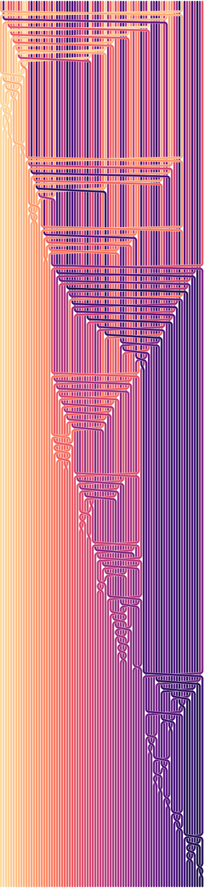

# sorting-visualizations

This Python program generates SVG sorting visualizations based on <a href="https://bost.ocks.org/mike/">Mike Bostock</a>'s 
<a href="https://bl.ocks.org/mbostock/6dcc9a177065881b1bc4">quicksort visulizations</a> which were in turn inspired by
<a href="https://corte.si/index.html">Aldo Cortesi</a>'s
<a href="https://corte.si/posts/code/visualisingsorting/index.html">sorting visualizations</a>. This visualization
differs slightly aesthetically from the other two - instead of displaying swaps with hard edges, it uses smooth curves.

The following sample output image is a visualization of sorting 80 randomly arranged items using Quicksort with the 
<a href="https://en.wikipedia.org/wiki/Quicksort#Hoare_partition_scheme">Hoare partition scheme</a>. Each row 
represents the state of the array after a swap operation is performed. 

